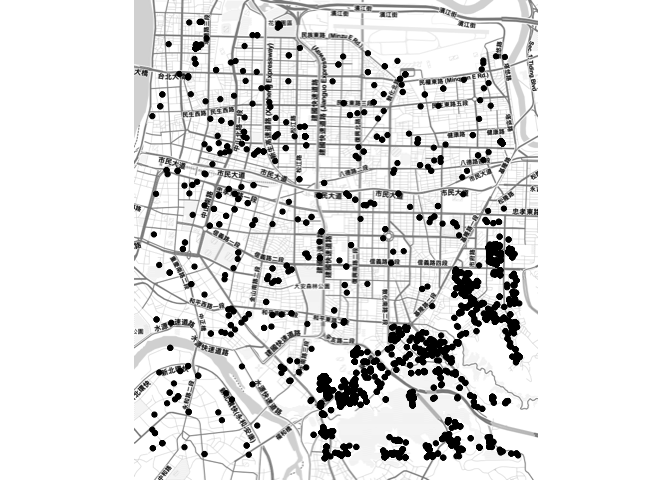

<!-- README.md is generated from README.Rmd. Please edit that file -->
Pokemon Sightings Data Stored in BigQuery
=========================================

Datasets contained in this package:

| Item                    | Title                                             |
|:------------------------|:--------------------------------------------------|
| clefairy                | All Clefairy Sightings in Taipei City             |
| daily\_pm\_count        | Daily Pokemon Sightings Count                     |
| pm\_count\_by\_hour     | Hourly Pokemon Sightings Count                    |
| pm\_freq                | Pokemon Sightings Frequencies                     |
| pm\_freq\_by\_hour      | Hourly Pokemon Sightings Frequencies              |
| sightings\_grid\_latlon | Pokemon Sightings in Taiwan Grouped in Grid Cells |

Installation
------------

``` r
# install.packages("devtools")
devtools::install_github("LinkerNetworks/pmbq")
```

Usage
-----

Import the `pmbq` library, and start ruling the pokemon world!

``` r
library(pmbq)
library(magrittr)
library(ggmap)

clefairy %>% qmplot(x= longitude, y= latitude, data = .)
```



The Detail of The Dataset
-------------------------

    head(clefairy)

|  pokemonId|  longitude|  latitude| created             |  dup\_cnt|
|----------:|----------:|---------:|:--------------------|---------:|
|         35|   121.5632|  25.02768| 2016-08-24 00:03:11 |         1|
|         35|   121.5632|  25.02768| 2016-08-24 00:03:11 |         1|
|         35|   121.5676|  25.03177| 2016-08-24 00:07:50 |         1|
|         35|   121.5676|  25.03177| 2016-08-24 00:07:50 |         1|
|         35|   121.5545|  25.02300| 2016-08-24 00:08:36 |         1|
|         35|   121.5545|  25.02300| 2016-08-24 00:08:36 |         1|

    head(daily_pm_count)

| date\_created |  pokemonId|    cnt|
|:--------------|----------:|------:|
| 2016-08-24    |         98|  36620|
| 2016-08-24    |         41|  36189|
| 2016-08-24    |         32|  16365|
| 2016-08-24    |        133|  38787|
| 2016-08-24    |         35|  15290|
| 2016-08-24    |        117|    628|

    head(pm_count_by_hour)

|  pokemonId|  hour\_created|    cnt|
|----------:|--------------:|------:|
|         84|              8|   1036|
|        140|              8|    281|
|         32|              8|   3360|
|        114|              8|   1650|
|        129|              8|  22791|
|          1|              8|   3916|

    head(pm_freq)

|  pokemonId| name     |      freq|
|----------:|:---------|---------:|
|         68| Machamp  |  4.30e-06|
|         26| Raichu   |  7.60e-06|
|        135| Jolteon  |  7.60e-06|
|         65| Alakazam |  1.08e-05|
|         76| Golem    |  1.34e-05|
|         97| Hypno    |  1.41e-05|

    head(pm_freq_by_hour)

|  pokemonId|  hour\_created|    cnt|       freq|
|----------:|--------------:|------:|----------:|
|         84|              8|   1036|  0.0357007|
|        140|              8|    281|  0.0376121|
|         32|              8|   3360|  0.0364192|
|        114|              8|   1650|  0.0397485|
|        129|              8|  22791|  0.0361307|
|          1|              8|   3916|  0.0370514|

    head(sightings_grid_latlon)

|  cell\_x|  cell\_y|  avg\_cnt|       x|      y|
|--------:|--------:|---------:|-------:|------:|
|        6|       13|   51864.2|  120.30|  22.65|
|       32|       62|    4083.4|  121.60|  25.10|
|        5|       20|    9511.6|  120.25|  23.00|
|        7|       13|   14809.8|  120.35|  22.65|
|        6|       16|    2559.0|  120.30|  22.80|
|       24|       60|    1902.0|  121.20|  25.00|
